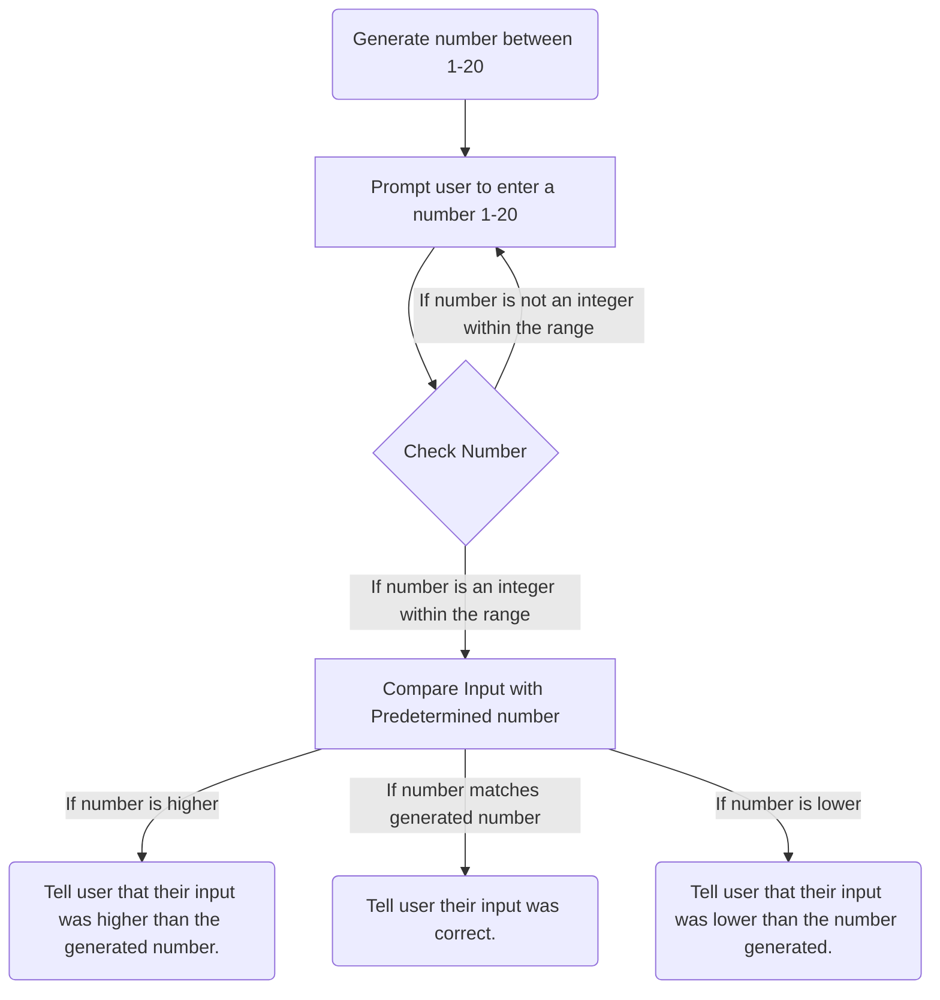

# Number Guessing Game Flowchart

This flowchart outlines the premises of a number guessing game that will be created in  Flowgorithm. Users will be asked to guess a random number in the range of 1-20, and will be given feedback on their answers. 

### Step by Step Description
1. Flowgorithm will generate a number between 1 and 20.
2. The user is then prompted to enter a number from 1-20.
3. The system checks the number making sure it is valid.
     * If the number is not an integer within the range of 1-20, the user will be prompted again to enter a number.
     * If the number is an integer within the range of 1-20, continue to step 4.
4. The user's input is compared to the generated number.
5. The user is told the results of their attempt.
    * If the number inputed was higher than the generated number, tell the user their input was too high.
    * If the number inputed was correct, tell the user they were correct.
    * If the number inputed was less than the generated number, tell the user their input was too low
